# Flask & Express Deployment on EC2 with Jenkins CI/CD

## 🌐 Live Demo
**Application URL:** [http://3.237.224.153:3000/](http://3.237.224.153:3000/)

---

## 📋 Table of Contents
- [Project Overview](#project-overview)
- [Architecture Diagram](#architecture-diagram)
- [Part 1: EC2 Deployment](#part-1-ec2-deployment)
- [Part 2: Jenkins CI/CD Pipeline](#part-2-jenkins-cicd-pipeline)
- [Screenshots](#screenshots)
- [Repository Structure](#repository-structure)

---

## 📖 Project Overview

This project demonstrates the deployment of a full-stack application consisting of:
- **Flask Backend** (Python) - Running on port 5000
- **Express Frontend** (Node.js) - Running on port 3000

Both applications are deployed on a single AWS EC2 instance with automated CI/CD using Jenkins.

---

## 🏗️ Architecture Diagram

```
┌─────────────────────────────────────────────────────────────────┐
│                        AWS EC2 Instance                          │
│                     (Public IP: 3.237.224.153)                   │
│  ┌───────────────────────────────────────────────────────────┐  │
│  │                                                           │  │
│  │   ┌─────────────────┐         ┌─────────────────────┐    │  │
│  │   │  Express.js     │  HTTP   │    Flask Backend    │    │  │
│  │   │  Frontend       │ ──────► │    (Python)         │    │  │
│  │   │  Port: 3000     │         │    Port: 5000       │    │  │
│  │   └─────────────────┘         └─────────────────────┘    │  │
│  │           │                                               │  │
│  │           │                                               │  │
│  │   ┌───────▼───────────────────────────────────────────┐  │  │
│  │   │              PM2 Process Manager                   │  │  │
│  │   │  - express-frontend                                │  │  │
│  │   │  - flask-backend                                   │  │  │
│  │   └───────────────────────────────────────────────────┘  │  │
│  │                                                           │  │
│  │   ┌───────────────────────────────────────────────────┐  │  │
│  │   │                  Jenkins CI/CD                     │  │  │
│  │   │  - Backend Pipeline (Jenkinsfile-backend)         │  │  │
│  │   │  - Frontend Pipeline (Jenkinsfile-frontend)       │  │  │
│  │   └───────────────────────────────────────────────────┘  │  │
│  │                                                           │  │
│  └───────────────────────────────────────────────────────────┘  │
└─────────────────────────────────────────────────────────────────┘
                              │
                              │ GitHub Webhook
                              ▼
                    ┌─────────────────────┐
                    │   GitHub Repository │
                    └─────────────────────┘
```

---

## 🚀 Part 1: EC2 Deployment

### Step 1: Provisioning the EC2 Instance

1. **Launch EC2 Instance:**
   - AMI: Ubuntu Server (Free Tier Eligible)
   - Instance Type: t2.micro
   - Security Groups: Allow ports 22 (SSH), 3000 (Express), 5000 (Flask), 8080 (Jenkins)

2. **SSH into the Instance:**
   ```bash
   ssh -i your-key.pem ubuntu@3.237.224.153
   ```

3. **Install Dependencies:**
   ```bash
   # Update system packages
   sudo apt update && sudo apt upgrade -y

   # Install Python and pip
   sudo apt install python3 python3-pip python3-venv -y

   # Install Node.js
   curl -fsSL https://deb.nodesource.com/setup_18.x | sudo -E bash -
   sudo apt install nodejs -y

   # Install Git
   sudo apt install git -y

   # Install PM2 globally
   sudo npm install -g pm2
   ```

### Step 2: Application Setup

1. **Clone the Repository:**
   ```bash
   git clone <your-repository-url>
   cd deployec2
   ```

2. **Setup Flask Backend:**
   ```bash
   cd backend
   python3 -m venv venv
   source venv/bin/activate
   pip install -r requirements.txt
   ```

3. **Setup Express Frontend:**
   ```bash
   cd ../frontend
   npm install
   ```

4. **Start Applications with PM2:**
   ```bash
   # Start Flask Backend
   pm2 start "venv/bin/python app.py" --name flask-backend --cwd /home/ubuntu/deployec2/backend

   # Start Express Frontend
   pm2 start server.js --name express-frontend --cwd /home/ubuntu/deployec2/frontend

   # Save PM2 configuration
   pm2 save
   pm2 startup
   ```

### Application Endpoints

| Application | Port | URL |
|------------|------|-----|
| Express Frontend | 3000 | http://3.237.224.153:3000/ |
| Flask Backend | 5000 | http://3.237.224.153:5000/process |

---

## 🔄 Part 2: Jenkins CI/CD Pipeline

### Step 1: Install Jenkins

```bash
# Install Java (Jenkins dependency)
sudo apt install openjdk-17-jdk -y

# Add Jenkins repository
curl -fsSL https://pkg.jenkins.io/debian-stable/jenkins.io-2023.key | sudo tee /usr/share/keyrings/jenkins-keyring.asc > /dev/null
echo deb [signed-by=/usr/share/keyrings/jenkins-keyring.asc] https://pkg.jenkins.io/debian-stable binary/ | sudo tee /etc/apt/sources.list.d/jenkins.list > /dev/null

# Install Jenkins
sudo apt update
sudo apt install jenkins -y

# Start Jenkins
sudo systemctl start jenkins
sudo systemctl enable jenkins
```

### Step 2: Configure Jenkins

1. Access Jenkins at `http://3.237.224.153:8080`
2. Install required plugins:
   - Git Plugin
   - NodeJS Plugin
   - Pipeline Plugin
   - GitHub Integration Plugin

3. Configure NodeJS in Global Tool Configuration:
   - Name: `node18`
   - Version: NodeJS 18.x

### Step 3: Jenkins Pipeline Configuration

#### Backend Pipeline (Jenkinsfile-backend)

```groovy
pipeline {
    agent any

    stages {

        stage('Install Backend Dependencies') {
            steps {
                sh '''
                cd deployec2/backend
                if [ ! -d venv ]; then
                  python3 -m venv venv
                fi
                venv/bin/pip install flask
                '''
            }
        }

        stage('Restart Flask App') {
            steps {
                sh '''
                pm2 restart flask-backend || \
                pm2 start "deployec2/backend/venv/bin/python deployec2/backend/app.py" --name flask-backend
                '''
            }
        }
    }
}
```

#### Frontend Pipeline (Jenkinsfile-frontend)

```groovy
pipeline {
    agent any

    tools {
        nodejs 'node18'
    }

    environment {
        BACKEND_URL = "http://localhost:5000"
    }

    stages {

        stage('Install Frontend Dependencies') {
            steps {
                sh '''
                cd deployec2/frontend
                npm install
                '''
            }
        }

        stage('Restart Express App') {
            steps {
                sh '''
                pm2 restart express-frontend || \
                pm2 start deployec2/frontend/server.js --name express-frontend
                '''
            }
        }
    }
}
```

### Step 4: GitHub Webhook Configuration

1. Go to your GitHub repository → Settings → Webhooks
2. Add webhook:
   - Payload URL: `http://3.237.224.153:8080/github-webhook/`
   - Content type: `application/json`
   - Events: Push events
3. Jenkins pipeline will automatically trigger on every push

---

## 📸 Screenshots

### EC2 Instance & Application Screenshots

| # | Description | Screenshot |
|---|-------------|------------|
| 1 | Create folder with simple Flask application and deploy on GitHub | 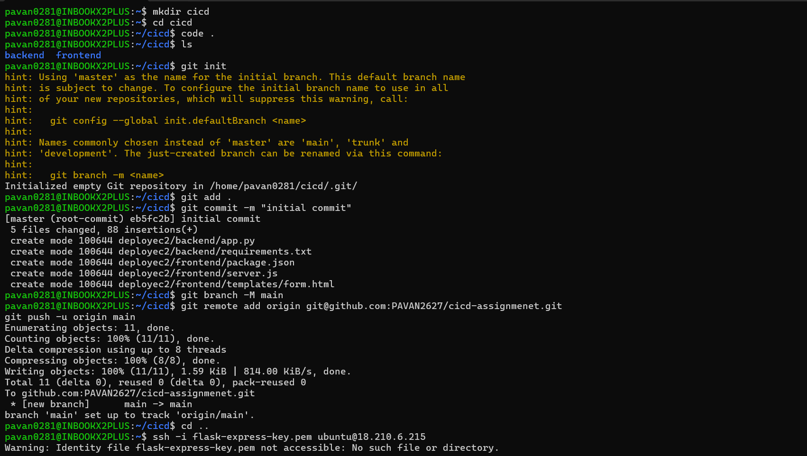 |
| 2 | Create EC2 instance and connect with CLI | 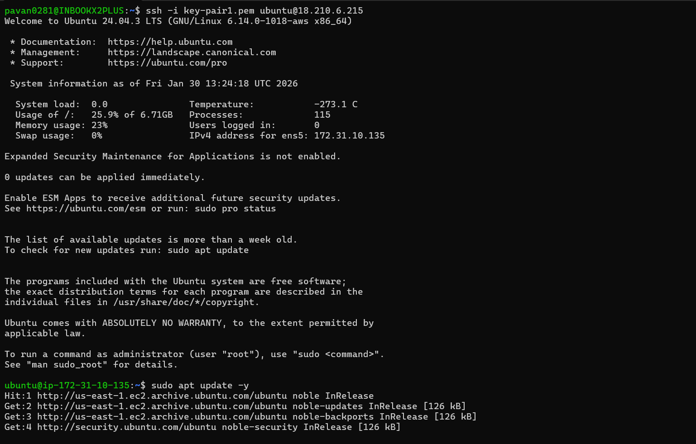 |
| 3 | Clone the simple application Git repo in EC2 | 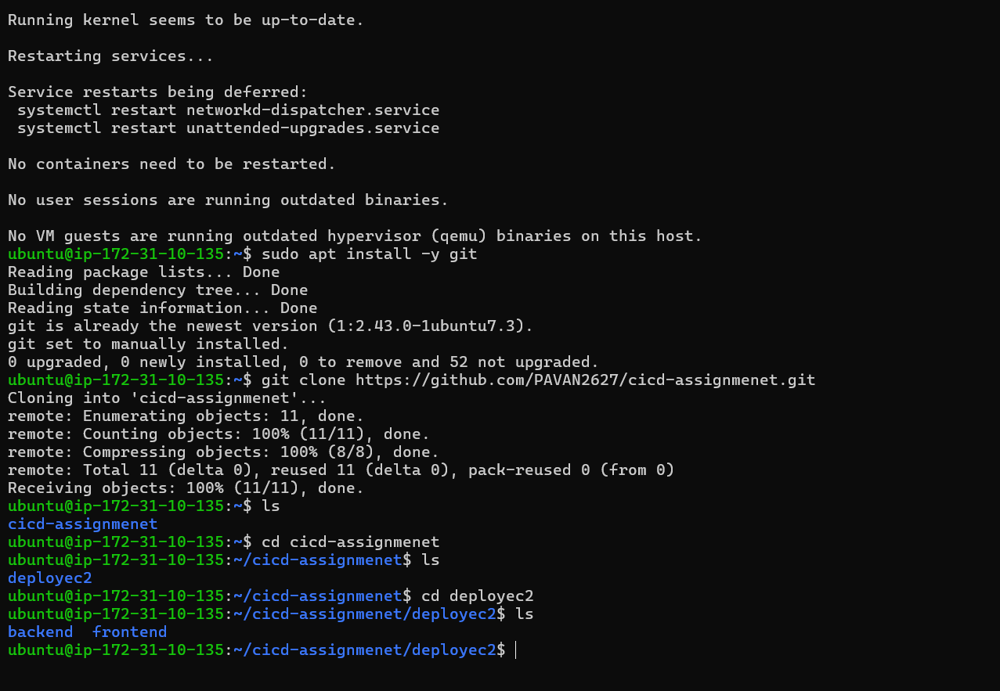 |
| 4 | Install all dependencies in EC2 | 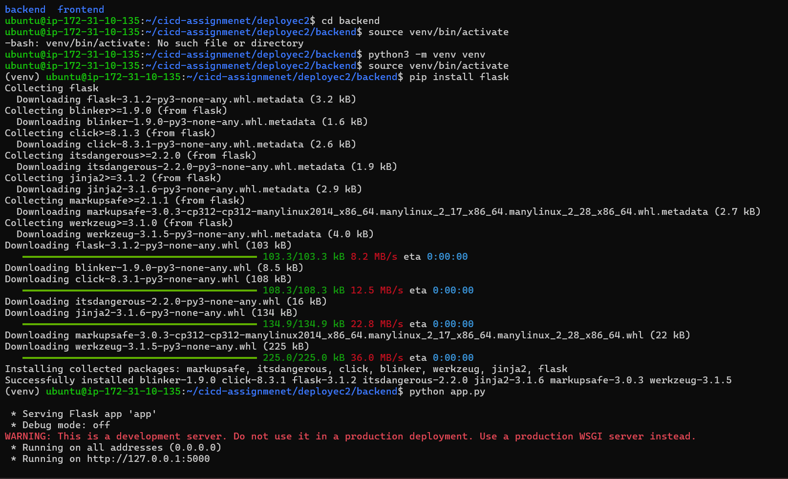 |
| 5 | Start PM2 for backend | 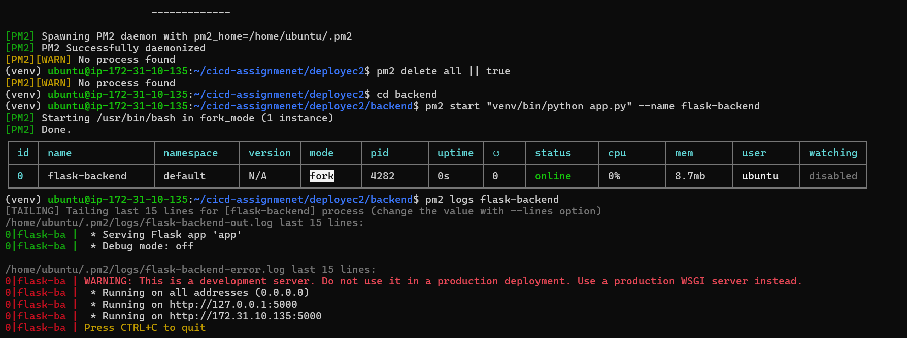 |
| 6 | Start PM2 for both frontend and backend running at a time | 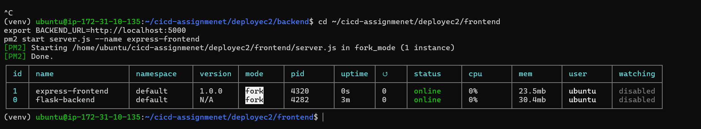 |
| 7 | EC2 running on dashboard | 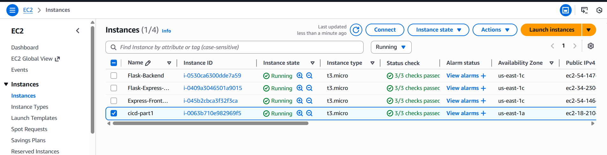 |

### Jenkins CI/CD Pipeline Screenshots

| # | Description | Screenshot |
|---|-------------|------------|
| 8 | Connect with EC2 at Local and start Jenkins | 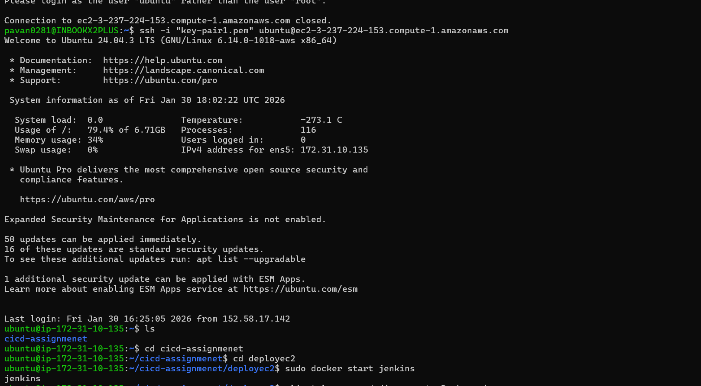 |
| 9 | Deploy backend and frontend both on Jenkins with GitHub repo | 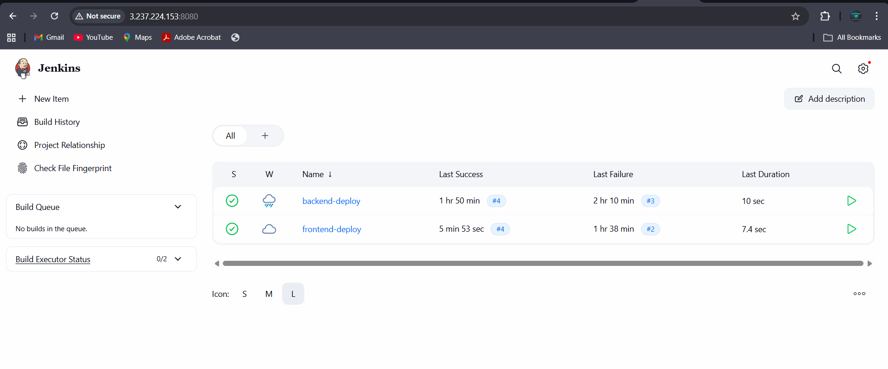 |
| 10 | Backend successfully deploy status | 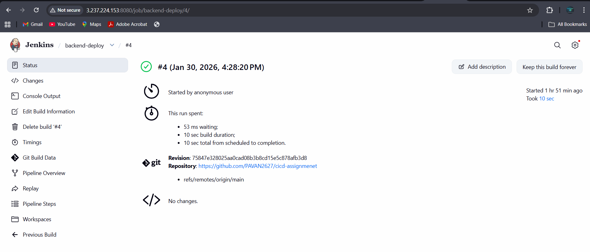 |
| 11 | Frontend success deploy status | 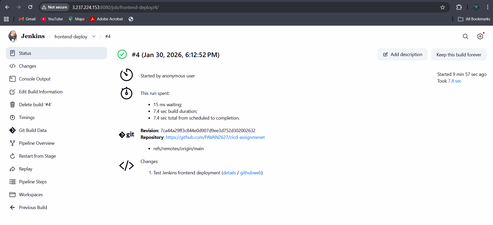 |

---

## 📁 Repository Structure

```
deployec2/
├── README.md                 # Project documentation
├── Jenkinsfile-backend       # Jenkins pipeline for Flask
├── Jenkinsfile-frontend      # Jenkins pipeline for Express
├── backend/
│   ├── app.py               # Flask application
│   └── requirements.txt     # Python dependencies
├── frontend/
│   ├── server.js            # Express application
│   ├── package.json         # Node.js dependencies
│   └── templates/
│       └── form.html        # Frontend HTML form
└── screenshots/             # Deployment & pipeline screenshots
    ├── 1.png
    ├── 2.png
    ├── ...
    └── 11.png
```

---

## 🛠️ Technologies Used

| Category | Technology |
|----------|------------|
| Backend | Python, Flask |
| Frontend | Node.js, Express.js |
| Cloud | AWS EC2 |
| Process Manager | PM2 |
| CI/CD | Jenkins |
| Version Control | Git, GitHub |

---

## 📝 Summary

This project successfully demonstrates:

✅ **Part 1 - EC2 Deployment:**
- Provisioned AWS EC2 instance
- Installed Python, Node.js, and Git
- Deployed Flask backend on port 5000
- Deployed Express frontend on port 3000
- Used PM2 for process management

✅ **Part 2 - Jenkins CI/CD:**
- Installed and configured Jenkins
- Created separate pipelines for backend and frontend
- Automated dependency installation
- Automated application restart on code changes
- Configured GitHub webhook for automatic triggers

---

## 👤 Author

Pavan

---

## 📄 License

This project is for educational purposes as part of the CI/CD deployment assignment.
